# T2 Programação Web
## INF1407 22.2 PUC-Rio
### Theo Caldas (1911078) & Matheus Kulick (1911090)

# Minhoca Louca
Jogo baseado no famoso "Snake".  
<a href="https://minhoca-louca-app.herokuapp.com">Clique aqui para acessar a página hospedada!</a> 

## 1. GDD
Nesse jogo, você é uma minhoca louca que precisa coletar frutas para ganhar pontos.  
Ao coletar uma fruta, além de aumentar a pontuação, a cauda da minhoca cresce um pouco.  
A minhoca está sempre em movimento e você sempre controla sua direção, à partir da cabeça.  
Você perde se a cabeça encostar na cauda ou em uma parede (cantos da tela).  

### 1.1 Dificuldades
Antes do início de uma partida, é necessário escolher o nível de dificuldade.  
Existem 3 níveis de dificuldade do jogo: Fácil, Médio e Difícil.    
Quanto maior a dificuldade, mais para dentro da terra a minhoca está. Logo, sua velocidade aumenta (menor tempo de reação).  

### 1.2 Identificação dos Elementos
Dependendo da dificuldade selecionada, diferentes sprites aparecerão.  

  Mapa (plano de fundo): 

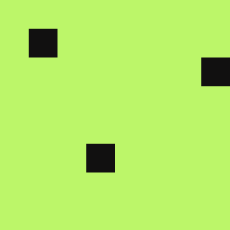
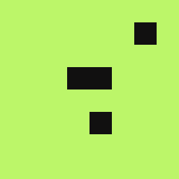
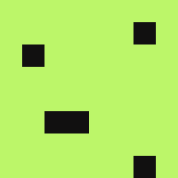 ou
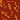

  Cabeça da minhoca: 
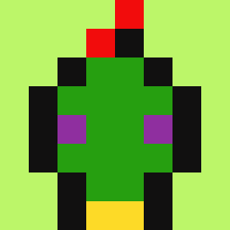 ou
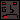

  Corpo da minhoca: 
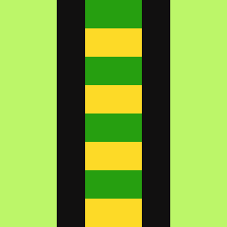
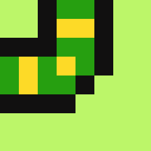
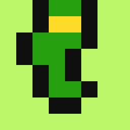 ou
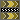

  Fruta (coletável):
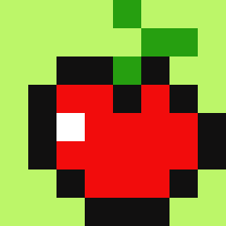
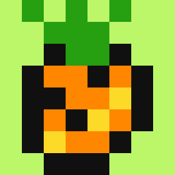
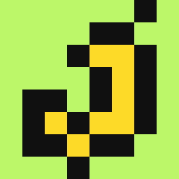 ou
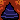
 

### 1.3 Fluxo de Telas
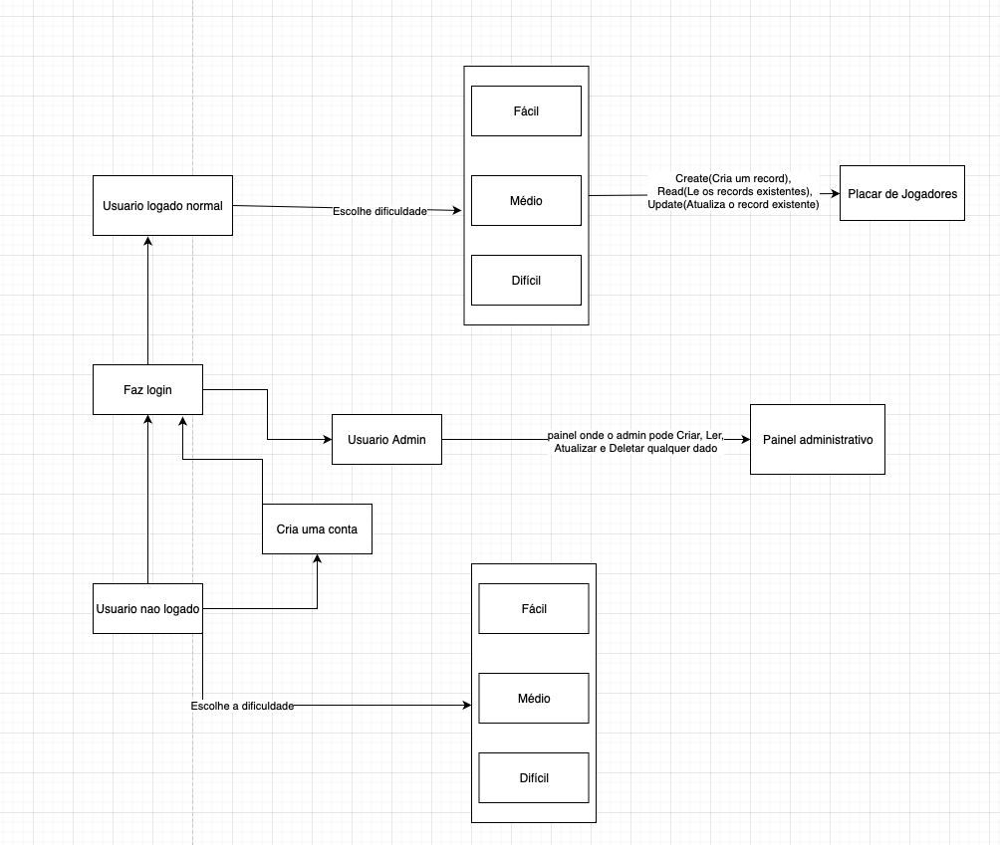

### 1.4 Autenticação e Leaderboard
O jogador pode jogar anonimamente (como visitante) ou criar uma conta.
Após cada partida, o jogador autenticado (logado em uma conta) terá sua pontuação salva e poderá comparar seu resultado atual com antigos e com outros jogadores na tela de leaderboard. 

### 1.5 Usuário Administrador
O administrador do site tem acesso a todos os placares e pode criar, apagar e atualizar cada um.
